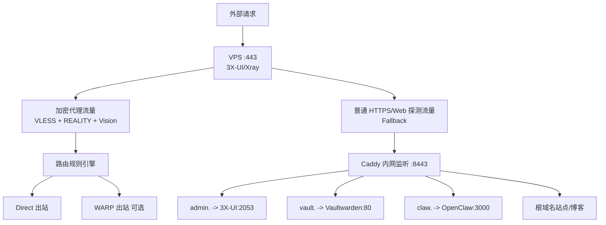

# 🚀 容器化高性能自建网络与应用集群服务设计规范（Spec）

> 目标：在单台 VPS 上，用 Docker Compose 实现「单端口入口 + 翻墙流量与 Web 流量共存 + 应用托管 + 可维护安全基线」。

---

## 1. 核心设计原则

1. **网络单入口**
   - 公网仅暴露 `443/tcp`（可选 `443/udp`）。
   - 其余服务端口（3X-UI 面板、Vaultwarden、OpenClaw、Caddy）全部内网化。

2. **职责分离（SoC）**
   - `3X-UI / Xray`：入口网关 + 协议识别 + 流量分流。
   - `Caddy`：仅在容器内处理反向代理与证书管理（DNS-01）。
   - 业务应用：仅提供应用能力，不直接接触公网。

3. **IP 纯净度隔离（可选增强）**
   - 普通流量直连。
   - 特定流量（AI 服务、部分游戏/风控敏感服务）走 WARP 出站，降低机房 IP 风险。

4. **向后兼容与低风险变更**
   - 不改客户端协议栈前提下演进服务端。
   - 所有升级均以“可回滚”为前提。

---

## 2. 架构拓扑（流量全生命周期）



---

## 3. 域名与 DNS 规划

由于一级域名已有生产业务，本系统使用二级域名专用命名空间，避免相互影响。

### 3.1 资产分配

- 基础域名：`vps.example.com`
- 站点：`vps.example.com`
- 3X-UI 面板：`admin.vps.example.com`
- Vaultwarden：`vault.vps.example.com`
- OpenClaw：`claw.vps.example.com`

### 3.2 Cloudflare DNS 记录（DNS Only / 灰云）

仅保留两条即可：

1. `A` 记录：`vps` -> `VPS_REAL_IP`
2. 泛解析：`*.vps` -> `vps.example.com`（`A` 或 `CNAME`）

---

## 4. 目录结构约定

```text
.
├─ docker-compose.yml
├─ .env
├─ 3x-ui/
│  ├─ db/
│  └─ config/
├─ caddy/
│  ├─ Caddyfile
│  ├─ data/
│  └─ config/
├─ vaultwarden/
└─ openclaw/
   └─ config/
```

---

## 5. 环境变量规范（`.env`）

```env
# 基础
TZ=Asia/Shanghai
MY_DOMAIN=vps.example.com
CF_API_TOKEN=cf_token_with_dns_edit_permission

# 3X-UI 初始化（若镜像版本不支持，首次启动后在面板内修改）
XUI_ADMIN_USER=admin
XUI_ADMIN_PWD=change_me_strong_password

# Vaultwarden
VAULTWARDEN_ADMIN_TOKEN=change_me_long_random_token
```

---

## 6. 容器编排规范（`docker-compose.yml`）

```yaml
version: "3.9"

x-logging: &default-logging
  driver: json-file
  options:
    max-size: "10m"
    max-file: "3"

networks:
  edge-net:
    driver: bridge
  app-net:
    driver: bridge
    internal: true

services:
  3x-ui:
    image: ghcr.io/mhsanaei/3x-ui:latest
    container_name: 3x-ui
    restart: unless-stopped
    ports:
      - "443:443/tcp"
      - "443:443/udp"
    volumes:
      - ./3x-ui/db:/etc/x-ui
      - ./3x-ui/config:/etc/xray
    environment:
      TZ: ${TZ}
      XRAY_VMESS_AEAD_FORCED: "false"
      XUI_ADMIN_USER: ${XUI_ADMIN_USER}
      XUI_ADMIN_PWD: ${XUI_ADMIN_PWD}
    cap_add:
      - NET_ADMIN
      - NET_RAW
    security_opt:
      - no-new-privileges:true
    networks:
      - edge-net
      - app-net
    logging: *default-logging

  caddy:
    build:
      context: .
      dockerfile_inline: |
        FROM caddy:2-builder AS builder
        RUN xcaddy build --with github.com/caddy-dns/cloudflare
        FROM caddy:2
        COPY --from=builder /usr/bin/caddy /usr/bin/caddy
    container_name: caddy
    restart: unless-stopped
    environment:
      TZ: ${TZ}
      MY_DOMAIN: ${MY_DOMAIN}
      CF_API_TOKEN: ${CF_API_TOKEN}
    volumes:
      - ./caddy/Caddyfile:/etc/caddy/Caddyfile:ro
      - ./caddy/data:/data
      - ./caddy/config:/config
    networks:
      - app-net
    depends_on:
      - 3x-ui
    security_opt:
      - no-new-privileges:true
    logging: *default-logging

  vaultwarden:
    image: vaultwarden/server:latest
    container_name: vaultwarden
    restart: unless-stopped
    environment:
      TZ: ${TZ}
      DOMAIN: https://vault.${MY_DOMAIN}
      SIGNUPS_ALLOWED: "false"
      WEBSOCKET_ENABLED: "true"
      ADMIN_TOKEN: ${VAULTWARDEN_ADMIN_TOKEN}
    volumes:
      - ./vaultwarden:/data
    networks:
      - app-net
    security_opt:
      - no-new-privileges:true
    logging: *default-logging

  openclaw:
    image: openclaw/openclaw:latest
    container_name: openclaw
    restart: unless-stopped
    environment:
      TZ: ${TZ}
    volumes:
      - ./openclaw/config:/app/config
    networks:
      - app-net
    security_opt:
      - no-new-privileges:true
    logging: *default-logging
```

---

## 7. 反向代理规范（`caddy/Caddyfile`）

> 说明：Caddy 在容器内监听 `:8443`，由 Xray fallback 转发到该端口。
> 证书通过 Cloudflare DNS-01 自动签发续期，不依赖公网 80 端口。

```caddyfile
{
    email ops@{$MY_DOMAIN}
    acme_dns cloudflare {env.CF_API_TOKEN}
}

admin.{$MY_DOMAIN}:8443 {
    reverse_proxy 3x-ui:2053
}

vault.{$MY_DOMAIN}:8443 {
    encode gzip zstd
    reverse_proxy vaultwarden:80
}

claw.{$MY_DOMAIN}:8443 {
    reverse_proxy openclaw:3000
}

{$MY_DOMAIN}:8443 {
    respond "vps gateway online" 200
}
```

---

## 8. 3X-UI / Xray 入站核心规范

### 8.1 入站参数（强约束）

- 端口：`443`
- 协议：`VLESS`
- 流控：`xtls-rprx-vision`
- 安全：`reality`
- Fallback 目标：`caddy:8443`（**禁止** `127.0.0.1`）
- SNI / ServerNames：使用本域名体系中可控域名（例如 `admin.vps.example.com`）

### 8.2 路由策略（建议）

- 默认：`direct`
- 特种流量（AI 服务、风控敏感服务）-> `warp`
- 游戏 UDP 可按目标端口段或域名分流，避免全量走 WARP 导致延迟抖动。

---

## 9. 客户端（ImmortalWrt / sing-box）接入规范

1. 核心：`sing-box`（可通过 HomeProxy）
2. 必开 TUN：
   - `auto_route: true`
   - `strict_route: true`
3. 游戏优化建议：
   - 国内到 VPS 走优质线路（如 CN2 GIA / 9929）
   - VPS 内按规则转发至 direct / warp，避免本地端封装链路过长

---

## 10. 安全与运维基线（必须）

### 10.1 主机防火墙

- 放行：`443/tcp`、`443/udp`
- SSH（22）仅允许管理 IP 白名单
- 拒绝其余入站

### 10.2 备份范围

- `3x-ui/db`、`3x-ui/config`
- `caddy/data`、`caddy/config`
- `vaultwarden/`
- `openclaw/config`

建议：每日增量、每周全量；至少保留 7~30 天。

### 10.3 升级策略

- 使用固定镜像标签（避免 `latest` 直接上生产）
- 升级前快照备份 + 回滚预案
- 分批验证：先 Caddy / 应用，再 3X-UI/Xray

### 10.4 可观测性

- Docker 日志轮转（已在 compose 设置）
- 建议接入基础监控：CPU、内存、磁盘、容器重启次数、证书到期天数

---

## 11. 验收清单（Go-Live Checklist）

- [ ] 公网仅 `443` 可访问
- [ ] `admin/vault/claw` 三个域名可正常访问
- [ ] 3X-UI 面板未直接暴露公网端口
- [ ] 证书自动签发成功（DNS-01）
- [ ] Vaultwarden 禁止开放注册
- [ ] 路由规则已验证：direct 与 warp 均可用
- [ ] 备份与回滚流程演练通过
